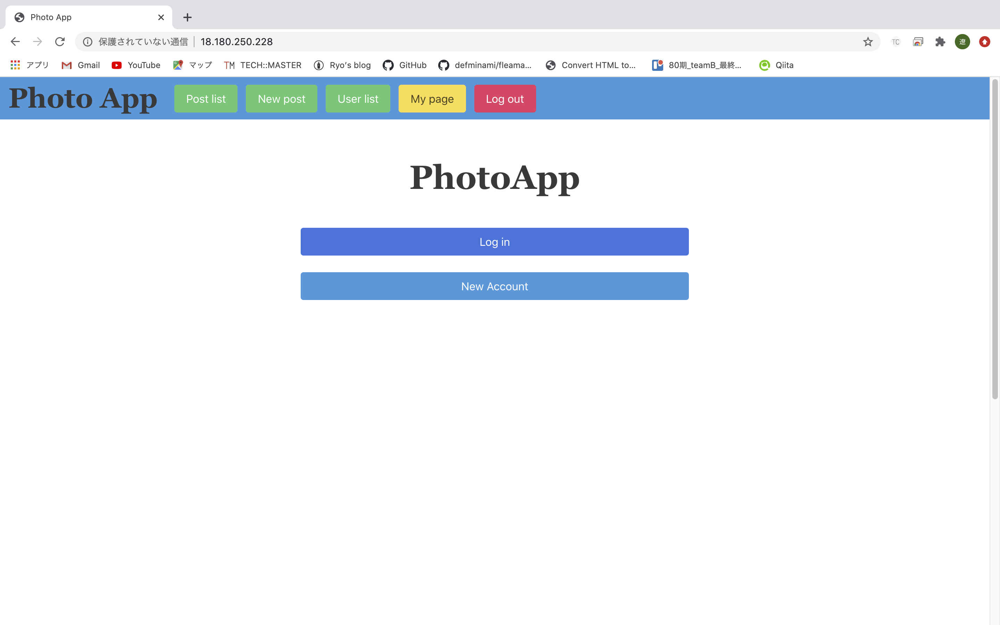
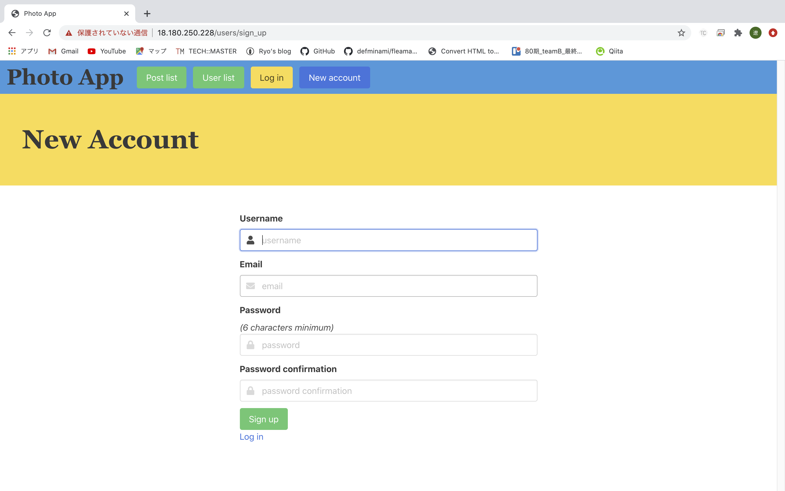
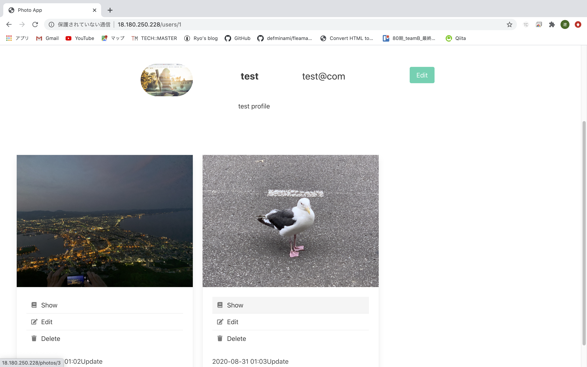
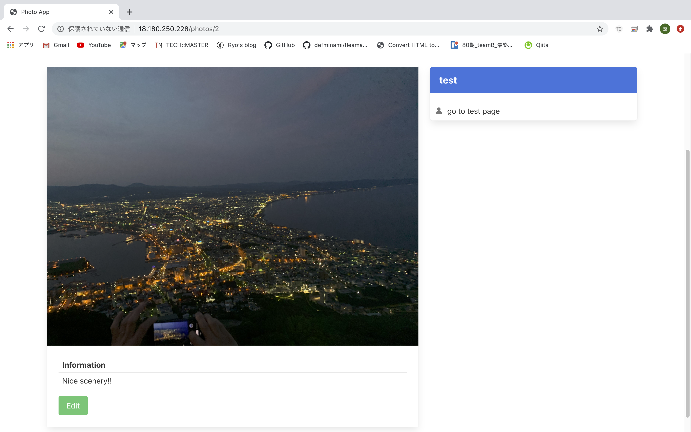
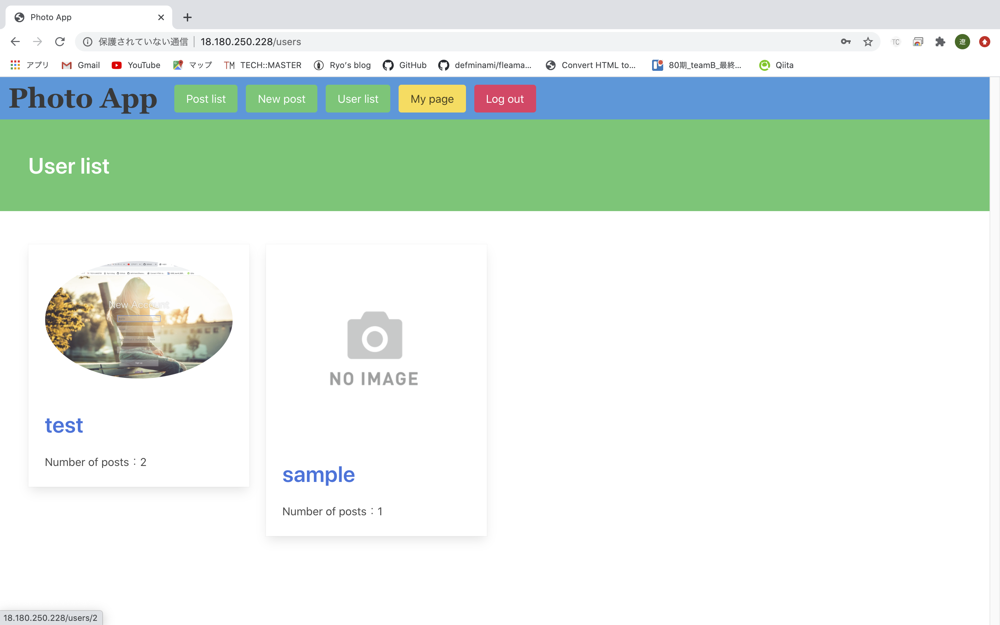

# README

# 作成理由

* このWebアプリは世界中誰でも使えるように簡単な英語を使っています。
目的は海外の人の文化に触れやすくしたり、海外に興味があまりない人にも写真から興味を持って海外が好きになって欲しいからです。
最近SNS等で海外の人の投稿などが見れますがまだまだごく一部なのでこういった海外の人の生活などを知る機会をもっと増やして欲しいからです。

# アプリ説明

* このアプリにはログイン機能があります。
* この画面でログインや新規登録ができます。
 
 

* 個人のプロフィールが見ることができます。
* 一人の投稿一覧とプロフィールを見ることができ、自分の投稿なら削除や編集ができます。
 

* 投稿の詳細ページです。
* ここには投稿の情報や感想などがかけます。
* 右側にはこの投稿をしている人のプロフィール画面へいくことができます。
 

* 投稿一覧画面です。
* 投稿すると投稿した日付や時間も記録することができます。
 

* ユーザー一覧画面です。
* ここでは登録している全てのユーザーを見ることができます。
 

# 今後追加したい機能
* 検索機能
* いいね機能
* コメント機能・ダイレクトメッセージ機能
* 翻訳機能・言語変更機能